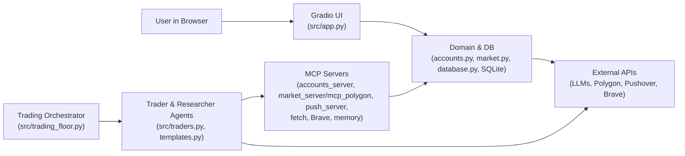

## AI MCP Autonomous Traders

Autonomous AI traders that use the **Model Context Protocol (MCP)**, multiple LLMs and real market data to research opportunities, execute trades on simulated accounts, and surface results in a Gradio dashboard.

---

## Objective

- **Simulate a team of autonomous traders** (Warren, George, Ray, Cathie) with different investment styles.
- **Use LLM agents plus MCP tools** to:
  - Research markets and news.
  - Query market data and account state.
  - Execute buy/sell orders and adjust strategies.
- **Visualize portfolios and activity** in a browser‑based UI with live logs, PnL, holdings and transaction history.

---

## Very High‑Level Flow (Simplified)

A simple block diagram of the main runtime:



At a glance:

- The **orchestrator** triggers **trader agents** on a schedule.
- Traders use **MCP tools** and **LLMs** to research and trade.
- All state changes go through **domain code** and **SQLite**.
- The **UI** simply reads from the same DB and logs to show what’s happening.

---

## Two main players per trader

Each trader is built from **two agents**:

| Player | Role | What it uses |
|--------|------|----------------|
| **Trading Agent** | Decides what to trade, executes orders, rebalances, sends push notifications. | **MCP servers:** `accounts_server` (account tools + resources; account/strategy are also loaded into the initial message via `accounts_client`), `push_server`, market (`market_server` or `mcp_polygon`). **One tool:** the Researcher (Research Agent wrapped as a tool). |
| **Research Agent** | Does deeper market/news research when the Trader asks. | **MCP servers only** (each exposes tools): `mcp-server-fetch` (HTTP fetch), `@modelcontextprotocol/server-brave-search` (Brave Search), `mcp-memory-libsql` (per‑trader memory at `./memory/{name}.db`). |

The **Research Agent is wrapped as a tool** and the **Trader Agent uses it as a tool**. Flow: build Researcher agent (with researcher MCP servers) → expose as tool via `researcher.as_tool(...)` → build Trader agent with `tools=[tool]` and `mcp_servers=trader_mcp_servers`. See `src/traders.py` (e.g. `get_researcher`, `get_researcher_tool`, `create_agent`) and `src/mcp_params.py`.

---

## Tech Stack & Key Technologies

- **Language & Runtime**
  - Python (async/await, `asyncio`)

- **Agents & LLMs**
  - Custom `agents` framework (`Agent`, `Runner`, tools, tracing)
  - LLM APIs via `openai.AsyncOpenAI`:
    - OpenRouter
    - DeepSeek
    - Grok
    - Gemini (OpenAI‑compatible endpoint)

- **MCP (Model Context Protocol)**
  - `mcp`, `mcp.server.fastmcp`, `mcp.client.stdio`
  - Internal MCP servers:
    - `accounts_server.py` – account tools & resources
    - `market_server.py` (or external `mcp_polygon`) – market data tools
    - `push_server.py` – Pushover push notifications
  - External MCP servers:
    - `mcp-server-fetch`
    - `@modelcontextprotocol/server-brave-search`
    - `mcp-memory-libsql`

- **UI & Visualization**
  - Gradio (web UI)
  - Plotly Express and pandas (charts & tables)

- **Persistence & Infra**
  - SQLite (`accounts.db`) for accounts, logs, market cache
  - Polygon.io REST API for market data
  - Pushover API for mobile notifications
  - `python-dotenv` for environment configuration
  - `uv` / `uvx` and `npx` to run MCP servers

---

## Project Structure (Core)

- `src/app.py` – Gradio dashboard; shows each trader’s portfolio, holdings, transactions, and logs.
- `src/trading_floor.py` – background orchestrator; periodically runs all trader agents.
- `src/traders.py` – trader agent implementation; wires MCP servers and Researcher tool into LLM agents.
- `src/templates.py` – prompt templates and trade/rebalance messages.
- `src/accounts.py` – account model, buy/sell logic, PnL and reporting.
- `src/market.py` – market data access via Polygon or fallback.
- `src/database.py` – SQLite persistence (accounts, logs, market).
- `src/accounts_server.py` / `src/market_server.py` / `src/push_server.py` – MCP servers.
- `src/mcp_params.py` – how MCP servers are launched for traders and researchers.
- `src/reset.py` – reset accounts and strategies for all traders.
- `docs/architrcture.md` – high‑level architecture.
- `docs/LLD.md` – low‑level design and call flows.

---

## Prerequisites

- **Python** 3.10+ (recommended)
- **Node.js + npm** (for `npx`‑based MCP servers)
- **uv / uvx** installed (for running Python MCP servers)
- Accounts with API keys for:
  - Polygon.io (optional but recommended)
  - OpenRouter / DeepSeek / Grok / Gemini (as needed)
  - Brave Search (for research)
  - Pushover (for notifications)

---

## Setup

1. **Clone the repository**

```bash
git clone <this-repo-url>
cd ai-mcp-autonomous-traders
```

2. **Create and activate a Python virtual environment and Install Python dependencies**

> If you are using `uv`, you can instead run:
>
> ```bash
> uv sync
> ```

4. **Create and populate `.env`**

Create a `.env` file in the project root (or copy from an example if present) and set:

- LLM / routing:
  - `OPENROUTER_API_KEY=...`
  - `DEEPSEEK_API_KEY=...`
  - `GROK_API_KEY=...`
  - `GOOGLE_API_KEY=...` (for Gemini endpoint)
- Market data:
  - `POLYGON_API_KEY=...`
  - `POLYGON_PLAN=eod|paid|realtime`
- Search & memory:
  - `BRAVE_API_KEY=...`
- Notifications:
  - `PUSHOVER_USER=...`
  - `PUSHOVER_TOKEN=...`
- Scheduler / behavior (optional):
  - `RUN_EVERY_N_MINUTES=60`
  - `RUN_EVEN_WHEN_MARKET_IS_CLOSED=false`
  - `USE_MANY_MODELS=false`

5. **Initialize trader accounts and strategies (optional)**

```bash
cd src
uv run reset.py
```

This resets the four trader accounts (Warren, George, Ray, Cathie) with their respective strategies and starting balances.

---

## How to Run

### 1. Start the Trading Orchestrator

Runs all traders every `RUN_EVERY_N_MINUTES` minutes (default 60), checking market hours unless overridden.

```bash
cd src
uv run trading_floor.py
```

This process:

- Creates trader agents and researcher agents.
- Starts the required MCP servers as child processes (accounts, market, push, fetch, Brave, memory).
- Uses LLMs and MCP tools to research, trade, rebalance, and send push notifications.

### 2. Start the Web UI

In a separate terminal, run:

```bash
cd src
uv run app.py
```

This launches a Gradio app in your browser where you can:

- See each trader’s name, model, and title.
- Monitor portfolio value over time (charts and totals).
- Inspect holdings and recent transactions.
- Read logs showing trace and tool activity.

Both processes can run concurrently: **trading_floor** drives autonomous behavior, **app** visualizes it.

---

## Further Reading

- `docs/HLD.md` – architecture and diagrams.
- `docs/LLD.md` – detailed low‑level design and call flows.