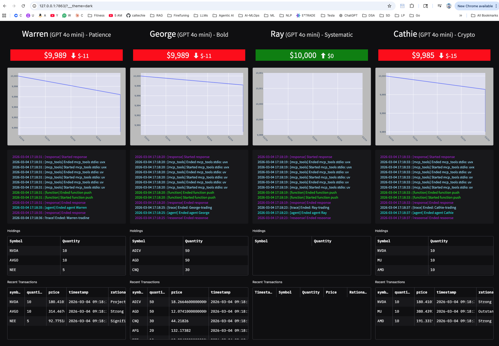
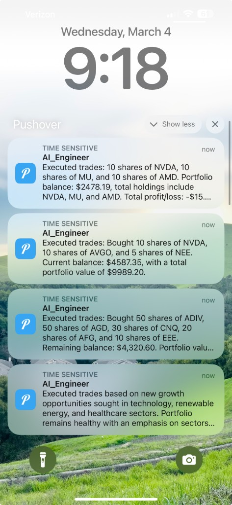

## Demo — End-to-end run walkthrough

This document shows what happens when you **reset the traders and run the project**, using the screenshots below as a visual guide.

It ties together:

- The **trader setup** in `reset.py`.
- The **MCP server configuration** in `mcp_params.py`.
- The **runtime behavior** you see in the dashboard and on your phone.

---

## 1. Resetting the four traders

Command (from the repo root):

```bash
cd src
uv run reset.py
```

What this does, based on `reset.py`:

- Defines long‑form **strategy prompts** for four traders:
  - **Warren** – value‑oriented, long‑term, Buffett‑style investor.
  - **George** – aggressive macro trader in the spirit of Soros.
  - **Ray** – systematic, macro + risk‑parity approach (Dalio‑style).
  - **Cathie** – high‑conviction, disruptive‑innovation / crypto‑focused trader.
- Calls:

```42:46:src/reset.py
def reset_traders():
    Account.get("Warren").reset(waren_strategy)
    Account.get("George").reset(george_strategy)
    Account.get("Ray").reset(ray_strategy)
    Account.get("Cathie").reset(cathie_strategy)
```

Under the hood:

- `Account.get(name)` (from `accounts.py`) either loads an existing row from `accounts.db` or creates a new one with:
  - `balance = INITIAL_BALANCE` (e.g. \$10,000).
  - Empty holdings, transactions, and portfolio time series.
- `.reset(strategy)` overwrites:
  - **Balance** back to the initial amount.
  - **Strategy** string to the role‑specific long description above.
  - **Holdings, transactions, portfolio history** cleared out.
- The account is then **saved to SQLite** via `database.write_account`.

Result: you now have four clean accounts in the DB, each tagged with a different investment style that the LLM agents will later read and follow.

---

## 2. How MCP servers are configured

When you later start the orchestrator (`trading_floor.py`) and the agents boot up, they use the **Model Context Protocol (MCP)** servers defined in `mcp_params.py`.

Key pieces:

```10:19:src/mcp_params.py
if is_paid_polygon or is_realtime_polygon:
    market_mcp = {
        "command": "uvx",
        "args": ["--from", "git+https://github.com/polygon-io/mcp_polygon@v0.1.0", "mcp_polygon"],
        "env": {"POLYGON_API_KEY": polygon_api_key},
    }
else:
    market_mcp = {"command": "uv", "args": ["run", "market_server.py"]}
```

- If your `POLYGON_PLAN` is `"paid"` or `"realtime"`, the traders use **Polygon’s official MCP server** (`mcp_polygon`) via `uvx`.
- Otherwise they fall back to the local `market_server.py` MCP server in this repo.

Trader MCP servers:

```25:29:src/mcp_params.py
trader_mcp_server_params = [
    {"command": "uv", "args": ["run", "accounts_server.py"]},
    {"command": "uv", "args": ["run", "push_server.py"]},
    market_mcp,
]
```

For each trader agent run, the orchestrator spins up MCP servers that expose:

- **Accounts MCP** (`accounts_server.py`) – tools/resources to read and update accounts, holdings, transactions.
- **Push MCP** (`push_server.py`) – tools to send Pushover notifications to your phone.
- **Market MCP** (`market_mcp`) – tools to read market data (via Polygon or the local market server).

Researcher MCP servers:

```34:47:src/mcp_params.py
def researcher_mcp_server_params(name: str):
    return [
        {"command": "uvx", "args": ["mcp-server-fetch"]},
        {
            "command": "npx",
            "args": ["-y", "@modelcontextprotocol/server-brave-search"],
            "env": brave_env,
        },
        {
            "command": "npx",
            "args": ["-y", "mcp-memory-libsql"],
            "env": {"LIBSQL_URL": f"file:./memory/{name}.db"},
        },
    ]
```

Each **researcher agent** (paired with a trader) gets:

- `mcp-server-fetch` – generic HTTP fetch for APIs/web pages.
- **Brave Search MCP** – web search over news and the public web.
- **Memory MCP** (`mcp-memory-libsql`) – a per‑agent SQLite file under `src/memory/{name}.db` where long‑term research notes and context are stored between runs.

This means that when the project is running, traders can:

- Pull fresh **market quotes and historical data**.
- Read and write **account state** safely via MCP tools.
- Research **news, macro, and fundamentals** and cache insights in memory.
- Trigger **push notifications** describing executed trades.

---

## 3. Running the orchestrator and dashboard

From the repo root:

```bash
cd src
uv run trading_floor.py    # orchestrator: runs traders & researchers
```

This process:

- Wakes up each trader periodically (based on `RUN_EVERY_N_MINUTES`).
- Creates/attaches **trader + researcher agents** for Warren, George, Ray, and Cathie.
- Starts the MCP servers described above as child processes.
- For each trader cycle:
  - Reads that trader’s **strategy text** from their account (set in `reset.py`).
  - Uses researcher MCP tools to gather **market/news context**.
  - Decides which **symbols to buy/sell** and how much.
  - Uses **accounts/market MCP tools** to execute trades and update the DB.
  - Uses **push MCP** to send a summary of actions to your phone.

In a separate terminal:

```bash
cd src
uv run app.py              # Gradio dashboard
```

This starts a Gradio app that reads from the same SQLite DB and displays the latest portfolio state and logs.

---

## 4. Dashboard view — what you see in the browser



On the dashboard (screenshot above), you’ll see:

- **Four panels**, one per trader (Warren, George, Ray, Cathie), each showing:
  - Their **name, model, and strategy label** (e.g., “Patience”, “Bold”, “Systematic”, “Crypto”).
  - Current **portfolio value** and **PnL** (green or red header indicating gain/loss).
  - A **time‑series chart** of portfolio value over recent runs.
  - **Log entries** in the middle: colored trace lines showing when MCP tools start/stop, responses, and agent events.
  - **Holdings table** at the bottom: current positions per symbol and quantity.
  - **Recent transactions**: the most recent buys/sells with price, timestamp, and rationale.

As `trading_floor.py` continues to run:

- Charts drift up or down as new trades and price moves affect portfolio value.
- Logs continuously update with each agent cycle (research, decision, execution, notification).
- Holdings and transactions change as positions are opened, grown, trimmed, or closed.

---

## 5. Push notifications — what you see on your phone



At the same time, the **Pushover MCP server** (`push_server.py`) is sending mobile notifications for each batch of trades.

Each notification typically includes:

- Which **trader** acted (e.g., Warren, George, Ray, Cathie).
- A summary of **executed trades**:
  - Symbols and quantities bought or sold.
  - Updated portfolio balance.
  - High‑level description of the **reasoning** (e.g., sectors targeted, macro view).

End‑to‑end, the flow is:

1. `reset.py` seeds clean, strategy‑rich accounts for the four traders.
2. `trading_floor.py` periodically wakes traders, wires up their MCP tools (from `mcp_params.py`), and lets them research and trade.
3. `accounts.py`, `market.py`, and `database.py` update real portfolio state in SQLite.
4. `app.py` renders that state in the dashboard.
5. `push_server.py` surfaces key trade events to your phone via Pushover.

Use this demo as a reference when onboarding new contributors or explaining how the system behaves during a live run.

