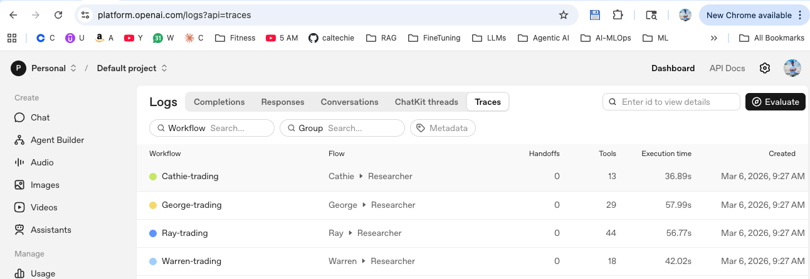
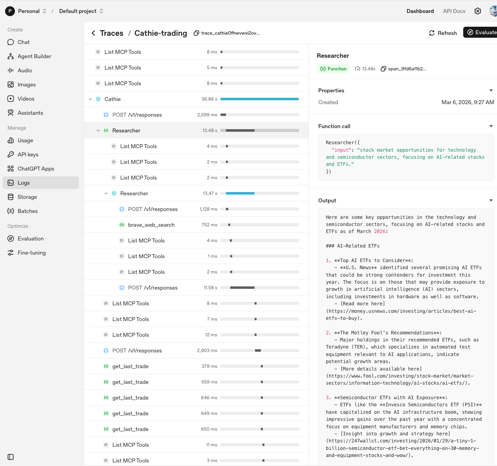
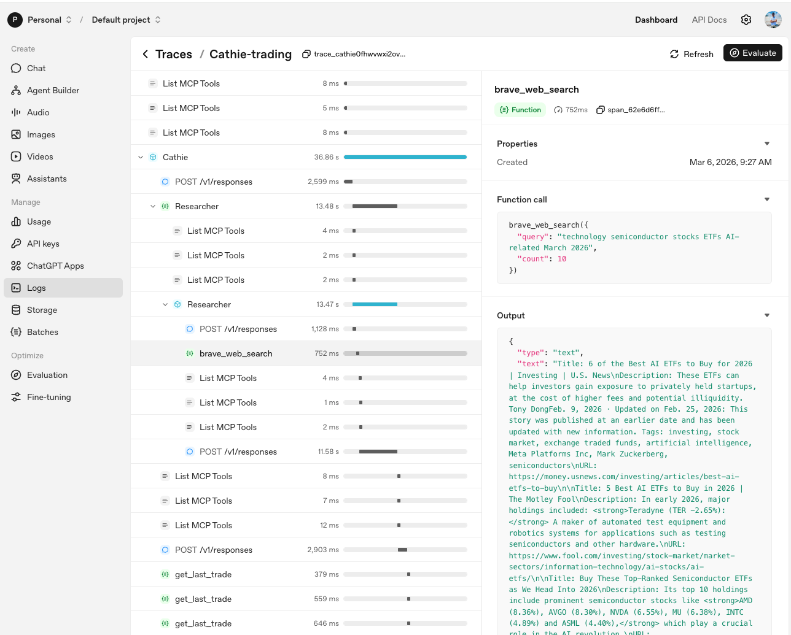
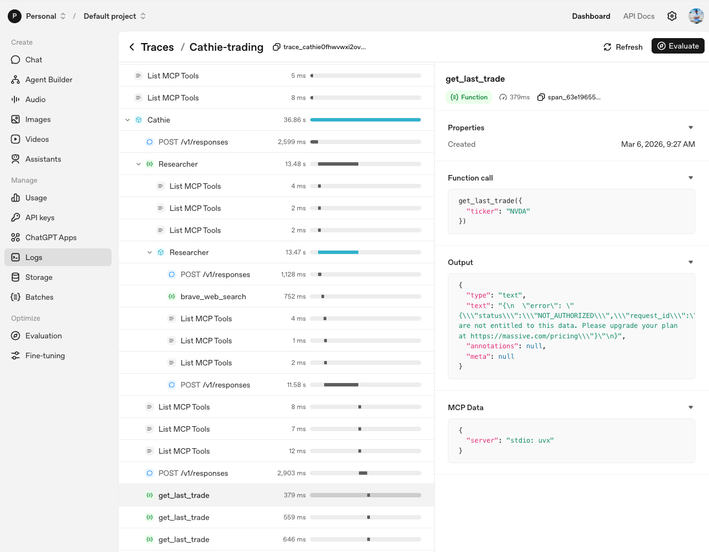
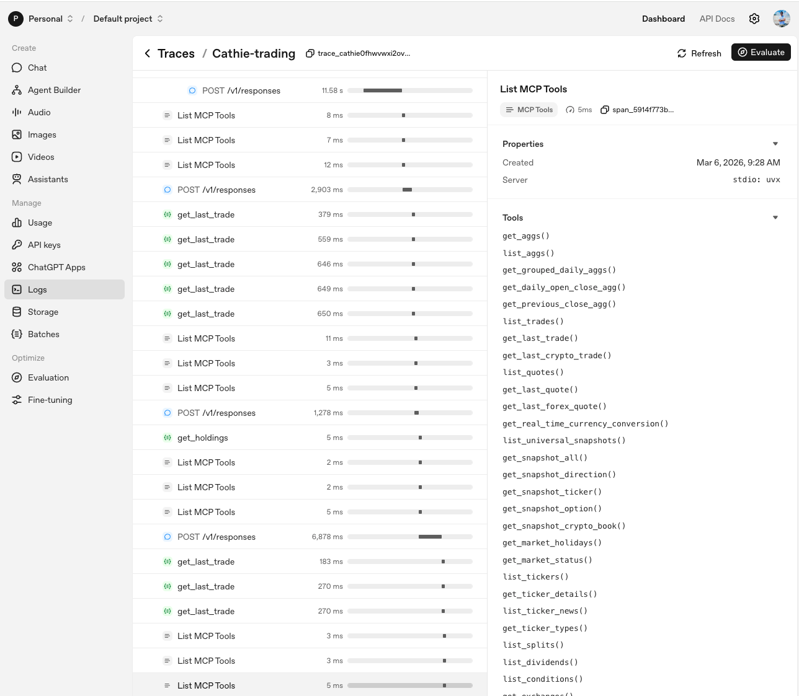

## Observability (Tracing) — OpenAI Agents SDK

This project uses **OpenAI Agents SDK tracing** to capture a full, time-ordered view of what each trader did during a run:

- LLM requests (`POST /v1/responses`)
- Tool calls (including the **Researcher tool**)
- MCP tool discovery (`List MCP Tools`) and MCP tool invocations
- Errors and timing for each step

You can view these traces in the OpenAI dashboard under **Logs → Traces**.

---

## Where tracing is enabled in code

There are two complementary observability paths:

### 1) OpenAI “Traces” (remote UI)

- Each trader run is wrapped in a `trace(...)` context in `src/traders.py`.
- The trace name is `"{TraderName}-trading"` or `"{TraderName}-rebalancing"`.

```140:152:src/traders.py
    async def run_with_trace(self):
        trace_name = f"{self.name}-trading" if self.do_trade else f"{self.name}-rebalancing"
        trace_id = make_trace_id(f"{self.name.lower()}")
        with trace(trace_name, trace_id=trace_id):
            await self.run_with_mcp_servers()
```

### 2) Local logs stored in SQLite (shown in the Gradio dashboard)

In `src/trading_floor.py`, we register `LogTracer()` which writes trace/span events into SQLite via `database.write_log(...)`.

```18:28:src/trading_floor.py
async def run_every_n_minutes():
    add_trace_processor(LogTracer())
    traders = create_traders()
    while True:
        if RUN_EVEN_WHEN_MARKET_IS_CLOSED or is_market_open():
            await asyncio.gather(*[trader.run() for trader in traders])
```

This is why the UI in `src/app.py` can show per-trader activity logs (it reads from the `logs` table).

---

## Why MCP “context” matters (and shows up in traces)

Each MCP server is started and connected inside `Trader.run_with_mcp_servers()` using `AsyncExitStack`.

- Entering the async context starts the subprocess and runs `connect()`.
- Exiting the context cleans everything up (disconnects and terminates subprocesses).

```170:193:src/traders.py
    async def run_with_mcp_servers(self):
        async with AsyncExitStack() as stack:
            # 0a) Trader MCP servers (accounts, push, market).
            trader_mcp_servers = [
                await stack.enter_async_context(
                    MCPServerStdio(params, client_session_timeout_seconds=120)
                )
                for params in trader_mcp_server_params
            ]
            # 0b) Researcher MCP servers (fetch, Brave search, memory).
            researcher_mcp_servers = [
                await stack.enter_async_context(
                    MCPServerStdio(params, client_session_timeout_seconds=120)
                )
                for params in researcher_mcp_server_params(self.name)
            ]
            # 0c) Run the agent; servers stay connected until we exit the stack.
            await self.run_agent(trader_mcp_servers, researcher_mcp_servers)
```

Because MCP servers expose tools, you’ll see “List MCP Tools” in traces when the agent discovers what tools are available from each MCP server.

---

## How to interpret the trace screenshots

All screenshots below are for **one trader run** (`Cathie-trading`), but the exact same mechanics apply to Warren / George / Ray.

### 1) Trace list: one workflow per trader



What you’re seeing:

- A separate trace per trader: **`Cathie-trading`**, **`George-trading`**, **`Ray-trading`**, **`Warren-trading`**.
- Each trace is started by `Trader.run_with_trace()` and corresponds to one scheduled “tick” driven by `trading_floor.py`.

---

### 2) Cathie trace overview: trader → researcher tool → MCP tools



Key things to notice:

- **`Cathie`** is the main agent run (the trader agent created in `Trader.create_agent()`).
- **`Researcher`** appears as a “Function” call because in `src/traders.py` we wrap the Researcher agent as a tool:

```68:69:src/traders.py
    return researcher.as_tool(tool_name="Researcher", tool_description=research_tool())
```

So when Cathie needs news/research, she calls the **Researcher tool**, which runs the Researcher agent (with its own MCP servers: fetch, Brave, memory).

- Multiple **“List MCP Tools”** entries indicate the agent is enumerating tools from one or more MCP servers (accounts/push/market or fetch/brave/memory).

---

### 3) Brave search tool call inside the Researcher run



This is the Researcher agent calling the **Brave Search MCP server** (configured in `src/mcp_params.py`):

```34:41:src/mcp_params.py
def researcher_mcp_server_params(name: str):
    return [
        {"command": "uvx", "args": ["mcp-server-fetch"]},
        {
            "command": "npx",
            "args": ["-y", "@modelcontextprotocol/server-brave-search"],
            "env": brave_env,
        },
```

In the trace, you can see:

- The **function call**: `brave_web_search({ query: ..., count: 10 })`
- The **tool output**: search results (titles, snippets, URLs) returned to the Researcher agent

Those results then feed back into Cathie’s trading decision.

---

### 4) Market MCP tool call: `get_last_trade` (and a permissions example)



This shows Cathie (or the Researcher) calling a **market data MCP tool** (`get_last_trade`).

Two important points:

- Which market MCP server is being used is decided in `src/mcp_params.py`:
  - If `POLYGON_PLAN` is `paid`/`realtime` → use external **`mcp_polygon`** (lots of tools)
  - Else → use internal `market_server.py` (just `lookup_share_price`)

```12:20:src/mcp_params.py
if is_paid_polygon or is_realtime_polygon:
    market_mcp = { "command": "uvx", "args": [..., "mcp_polygon"], "env": {"POLYGON_API_KEY": polygon_api_key} }
else:
    market_mcp = {"command": "uv", "args": ["run", "market_server.py"]}
```

- The screenshot shows an example error (`NOT_AUTHORIZED`) from the upstream data provider. This is a useful observability outcome: the trace clearly captures **which tool** was called, **with what inputs**, and **what error** came back.

---

### 5) “List MCP Tools”: what the market MCP server exposes



This view shows the tool inventory being returned by an MCP server (here it’s the external Polygon MCP server, judging by the large list).

Why this matters:

- It confirms which MCP server is active (internal fallback vs external Polygon MCP).
- It helps debug prompts and behavior: if the agent keeps calling a tool that doesn’t exist, or you expected a tool but it’s missing, this screen is the fastest way to verify tool availability.

---

## “Equivalent to LangGraph” (conceptually)

This is **conceptually similar** to LangGraph-style agent workflows in that you get:

- A run/workflow per trader (like a graph execution)
- A time-ordered sequence of nodes/spans (LLM calls, tool calls, MCP calls)
- Inputs/outputs captured for each step
- Errors and latency per step

The main difference is implementation style:

- Here, the “graph” is implicit in the agent + tool calls (Trader agent → Researcher tool → MCP tools).
- In LangGraph, you often define an explicit state machine / graph, but the observability goal is the same: **see every step, with timing and IO**.

---

## Same story for other traders

Warren / George / Ray follow the same tracing pattern because:

- `trading_floor.py` runs `await asyncio.gather(*[trader.run() for trader in traders])`
- Each `Trader.run()` wraps execution in `trace(...)`
- Each trader wires up the same MCP server sets (accounts/push/market + fetch/brave/memory)
- Each trader calls the Researcher tool as needed, and then uses MCP tools to query data and execute trades

So you’ll see one trace per trader per cycle, each with its own spans for research, market data calls, and account actions.

