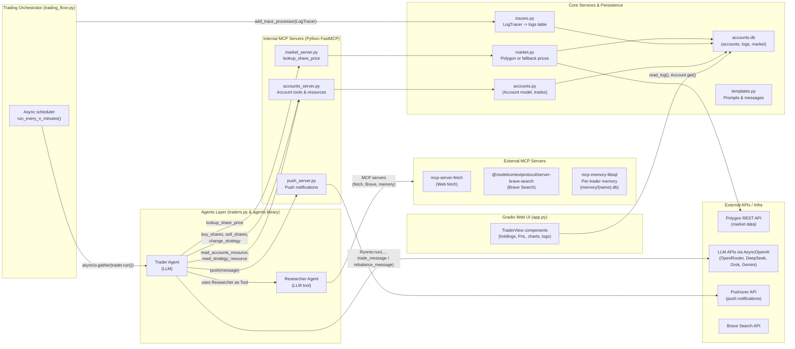
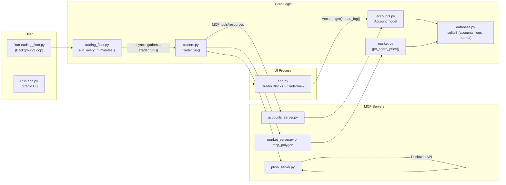

## AI MCP Autonomous Traders – Architecture

This document describes the high‑level architecture of the autonomous trading system in `src/`, how the main components interact, and the technologies used.

---

## High‑Level Overview

At a high level, the system consists of:

- **Web UI (`app.py`)**: Gradio dashboard showing each trader’s portfolio, holdings, transactions, and recent logs, updating on a timer.
- **Trading Orchestrator (`trading_floor.py`)**: Background scheduler that periodically runs all AI traders, respecting market hours and configuration.
- **Trader Agents (`traders.py`)**: Autonomous LLM agents that:
  - Read account state and strategy via MCP.
  - Use a **Researcher agent** (as a tool) to search news and data.
  - Decide on trades or rebalancing.
  - Call MCP tools to execute trades and send push notifications.
- **MCP Servers (`accounts_server.py`, `market_server.py`, `push_server.py`, external MCPs)**:
  - Expose account operations, market data, and push notifications as MCP tools/resources.
  - Also include external MCP servers for web fetch, Brave Search, and per‑trader memory.
- **Domain Services (`accounts.py`, `market.py`, `templates.py`, `tracers.py`, `database.py`)**:
  - Implement account logic, market data access, agent prompt templates, and trace logging.
- **Persistence**:
  - `sqlite3` DB (`accounts.db`) for accounts, logs, and cached market data.
  - Per‑trader memory databases (`memory/{name}.db`) for long‑term MCP memory.

---

## End‑to‑End Flow Diagram

Overall system data/interaction flow:

---

## Simplified High‑Level Code Flow

This simpler diagram focuses just on the main Python entrypoints and how control flows through the code at a high level:

---

## Component Breakdown

### Web UI Layer (`app.py`, `util.py`, `templates.py`)

- **Gradio UI (`app.py`)**
  - Constructs a multi‑column dashboard, one column per trader.
  - Uses `Trader` (UI wrapper, *not* the agent in `traders.py`) to:
    - Fetch `Account` data (portfolio value series, holdings, transactions).
    - Fetch recent logs via `database.read_log`.
  - Displays:
    - **Portfolio value** (numeric and chart) using `pandas` and `plotly.express`.
    - **Holdings** and **Recent transactions** as `gr.Dataframe`.
    - **Logs** as scrollable HTML.
  - Periodically refreshes:
    - Portfolio/holdings/transactions via a `gr.Timer` every 120s.
    - Logs via a fast `gr.Timer` (0.5s).
  - Styling via `css` and `js` from `util.py` and a Gradio theme.

- **Styling utilities (`util.py`)**
  - Defines shared CSS for PnL coloring and table sizing.
  - JS helper to force dark theme.
  - `Color` enum maps log types to colors for the UI.

- **Prompt templates (`templates.py`)**
  - **Researcher instructions**: guide the Researcher agent to search news/data and use knowledge‑graph tools.
  - **Trader instructions**: describe responsibilities, tools (researcher, market data, accounts), and goal (maximize profits).
  - **Messages**:
    - `trade_message(...)`: when the Trader should look for *new* opportunities and execute trades.
    - `rebalance_message(...)`: when the Trader should *rebalance* existing positions.

### Trading Orchestrator (`trading_floor.py`)

- Responsibilities:
  - Load configuration via environment (e.g. `RUN_EVERY_N_MINUTES`, `RUN_EVEN_WHEN_MARKET_IS_CLOSED`, `USE_MANY_MODELS`).
  - Define the set of trader identities (`names`, `lastnames`) and model names.
  - Create `Trader` instances from `traders.py`.
  - Install `LogTracer` into the global tracing system via `agents.add_trace_processor`.
  - In an infinite loop:
    - Check `market.is_market_open()` (unless overridden).
    - Concurrently run all traders (`asyncio.gather(trader.run() for trader in traders)`).
    - Sleep for `RUN_EVERY_N_MINUTES`.

This script is the **entrypoint for autonomous operation** when run as `python trading_floor.py`.

### Trader Agent Layer (`traders.py`)

- **Trader class (agent)**
  - Each instance represents an AI trader associated with a name and model.
  - Life cycle:
    1. **Create MCP servers** (see `mcp_params.trader_mcp_server_params` and `researcher_mcp_server_params(name)`).
    2. **Create Researcher tool** via `get_researcher_tool`, which internally builds a `Researcher` agent.
    3. **Create Trader agent** (`Agent` from the `agents` library) with:
       - Trader‑specific instructions (`trader_instructions`).
       - Tools: the Researcher tool + MCP tools for account/market/push.
    4. **Fetch current account and strategy** via `accounts_client.read_accounts_resource` and `read_strategy_resource`.
    5. **Build the message** (either trade or rebalance) using `templates.trade_message` / `rebalance_message`.
    6. **Run the conversation** with `Runner.run(self.agent, message, max_turns=MAX_TURNS)`.
  - **Tracing**:
    - `run_with_trace()` wraps execution in an `agents.trace(...)` context.
    - Trace IDs created via `tracers.make_trace_id`, embedding the trader name.
    - `LogTracer` then routes spans and traces into the `logs` table.
  - **MCP server lifecycle**:
    - Uses nested `AsyncExitStack` to start/stop all MCP servers for trader and researcher.
    - Ensures that subprocesses are correctly cleaned up after each run.
  - **Model routing**:
    - `get_model(model_name)` returns an `OpenAIChatCompletionsModel` backed by different `AsyncOpenAI` clients:
      - **OpenRouter** for generic `/` models.
      - **DeepSeek**, **Grok**, **Gemini** via their own base URLs and API keys.

### MCP Servers & Client (`mcp_params.py`, `accounts_client.py`, `accounts_server.py`, `market_server.py`, `push_server.py`)

- **MCP configuration (`mcp_params.py`)**
  - **Trader MCP servers**:
    - `accounts_server.py` (account tools + resources).
    - `push_server.py` (Pushover notifications).
    - Market server:
      - If Polygon API/plan supports it: use off‑the‑shelf `mcp_polygon` via `uvx`.
      - Otherwise, use local `market_server.py` via `uv run`.
  - **Researcher MCP servers**:
    - `mcp-server-fetch` (generic HTTP fetch).
    - `@modelcontextprotocol/server-brave-search` (Brave Search).
    - `mcp-memory-libsql` for persistent memory, with `LIBSQL_URL=file:./memory/{name}.db`.

- **Accounts MCP server (`accounts_server.py`)**
  - Wraps `Account` methods from `accounts.py` as MCP tools:
    - `get_balance`, `get_holdings`, `buy_shares`, `sell_shares`, `change_strategy`.
  - Exposes MCP resources:
    - `accounts://accounts_server/{name}` → full account report (`Account.report()`).
    - `accounts://strategy/{name}` → current strategy.
  - Runs using `FastMCP(...).run(transport="stdio")` for stdio integration.

- **Accounts MCP client (`accounts_client.py`)**
  - Uses `mcp.client.stdio.stdio_client` and `mcp.ClientSession` to:
    - List available tools on the accounts server.
    - Call tools generically or via the `FunctionTool` wrapper (for use with `agents`).
    - Read account and strategy resources.

- **Market MCP server (`market_server.py`)**
  - Single tool: `lookup_share_price(symbol: str) -> float`.
  - Delegates to `market.get_share_price(symbol)` (Polygon or random fallback).

- **Push notification MCP server (`push_server.py`)**
  - Tool: `push(message: str)` which:
    - Logs the message and POSTs to the Pushover API using `PUSHOVER_USER` and `PUSHOVER_TOKEN` from env.

### Domain & Infrastructure Services (`accounts.py`, `market.py`, `database.py`, `tracers.py`)

- **Accounts (`accounts.py`)**
  - Pydantic `Account` model with:
    - Balance, strategy, holdings (symbol → quantity), transactions, portfolio_value_time_series.
  - Key behaviors:
    - Initialization via `Account.get(name)` from DB (creating a default account if missing).
    - `buy_shares` / `sell_shares` with spread, cash checks, and log entries.
    - Portfolio value and PnL calculations.
    - Persisting state back to DB (`save`) and logging to `logs` table.

- **Market data (`market.py`)**
  - Uses `polygon.RESTClient` with `POLYGON_API_KEY` and `POLYGON_PLAN`.
  - Two modes:
    - **Paid/realtime**: per‑minute snapshots via `get_snapshot_ticker`.
    - **EOD**: grouped daily aggregates via `get_grouped_daily_aggs`; cached in DB with `write_market`/`read_market`.
  - Fallback to random prices if Polygon is unavailable.

- **Persistence (`database.py`)**
  - Initializes and manages a `sqlite3` DB (`accounts.db`) with tables:
    - `accounts` (name, serialized account JSON).
    - `logs` (for traces, spans, account events).
    - `market` (date → serialized price snapshot).
  - Functions:
    - `write_account`, `read_account`.
    - `write_log`, `read_log`.
    - `write_market`, `read_market`.

- **Tracing (`tracers.py`)**
  - `LogTracer` implements `agents.TracingProcessor`.
  - On trace/span start/end:
    - Extracts trader name from the trace ID.
    - Writes structured entries into `logs` with type and message composed from span metadata.
  - Enables the UI to show detailed per‑trader activity in near‑real time.

---

## Tech Stack & Key Technologies

- **Language & Runtime**
  - **Python** (async/await, `asyncio`, `contextlib.AsyncExitStack`).

- **Front‑End / UI**
  - **Gradio** for the interactive web dashboard.
  - **Plotly Express** and **pandas** for charts and tabular data.
  - Custom CSS and JS for styling and theme control.

- **Agents & LLMs**
  - Custom/3rd‑party **agents** framework:
    - `Agent`, `Tool`, `Runner`, `OpenAIChatCompletionsModel`, tracing.
  - **LLM APIs** via `openai.AsyncOpenAI`:
    - **OpenRouter** (router for many models).
    - **DeepSeek**, **Grok**, **Gemini** (Gemini OpenAI‑compatible endpoint).

- **Model Context Protocol (MCP)**
  - **FastMCP** for quickly defining MCP servers in Python.
  - MCP stdio clients (`mcp.client.stdio`) to connect agents to servers.
  - Multiple MCP servers:
    - Local: `accounts_server.py`, `market_server.py`, `push_server.py`.
    - External: `mcp-server-fetch`, `@modelcontextprotocol/server-brave-search`, `mcp-memory-libsql`, `mcp_polygon` (optional).

- **Persistence & Data**
  - **SQLite** for account, log, and market data in `accounts.db`.
  - **libSQL** (via `mcp-memory-libsql`) for per‑trader long‑term memory DBs.

- **Market Data & Notifications**
  - **Polygon.io REST API** for market data.
  - **Pushover API** for mobile push notifications.

- **Configuration & Environment**
  - **python‑dotenv** for loading `.env` values (API keys, schedule config, etc.).
  - Runners like `uv`, `uvx`, and `npx` to launch MCP server processes.

---

## How Everything Fits Together

- The **Orchestrator** periodically runs each **Trader agent**, which:
  - Uses **MCP servers** and **LLM models** to research markets, decide on trades, and execute actions.
  - Persists all account and market effects into **SQLite** and logs traces into the `logs` table.
- The **Gradio UI** reads from the same database and log stream to provide a live, human‑friendly view of:
  - Portfolio performance and transactions per trader.
  - Detailed action logs driven by the tracing system.
- External services (Polygon, Pushover, Brave Search, and LLM APIs) provide real‑world data, notifications, and intelligence, while MCP glues them into a single coherent tool surface for the agents.

