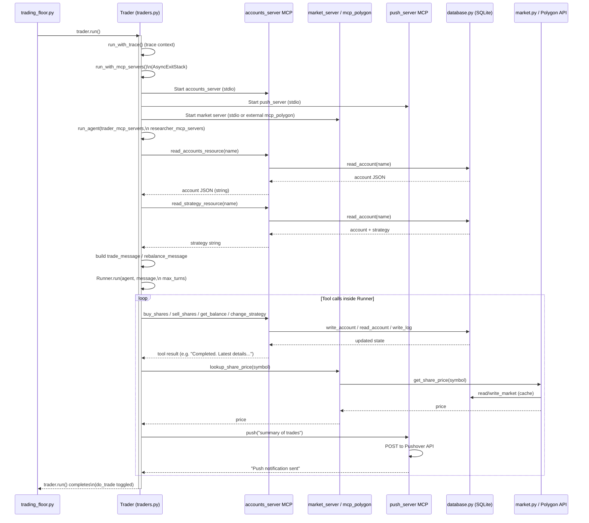
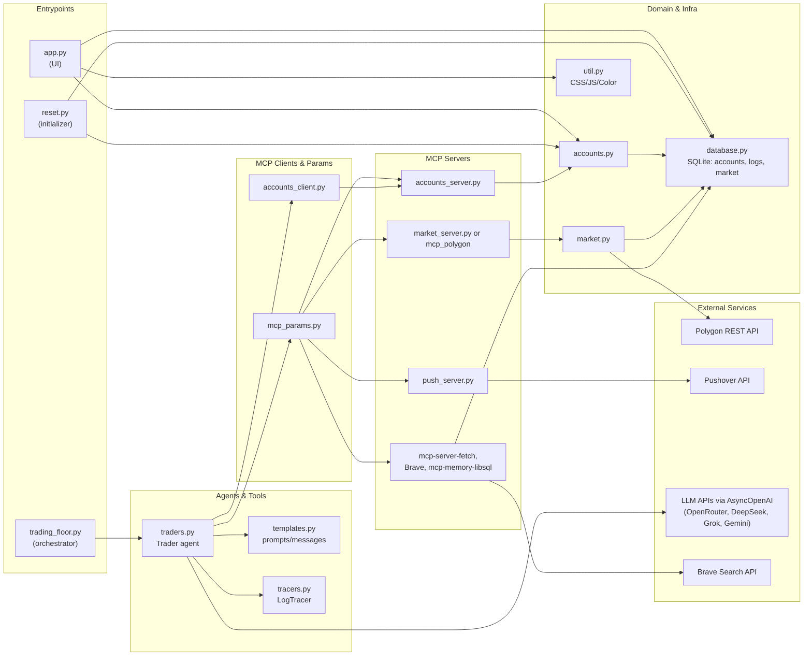

## Low‑Level Design (LLD) – AI MCP Autonomous Traders

This document captures **low‑level details** of how modules in `src/` interact, with special focus on:

- How **MCP servers** are configured and launched.
- Which **modules call which MCP tools/resources**.
- How **agents, MCP, DB, and external APIs** collaborate end‑to‑end.
- Code‑oriented diagrams showing call flow.

---

## 1. Key Runtime Entry Points

- **`trading_floor.py`** – background orchestrator that periodically runs all AI traders.
- **`app.py`** – Gradio web UI that visualizes trader portfolios and logs.
- **`accounts_server.py` / `market_server.py` / `push_server.py`** – MCP servers started as child processes via `uv` / `uvx` / `npx`.
- **`reset.py`** – helper script to initialize trader strategies and account state.

These scripts are usually invoked via:

- `python trading_floor.py` – run the trading loop.
- `python app.py` – start the UI.
- `uv run accounts_server.py`, `uv run market_server.py`, `uv run push_server.py` – MCP servers (launched indirectly via MCP params).
- `python reset.py` – reset accounts and strategies.

---

## 2. MCP Configuration and Process Topology

### 2.1 MCP Parameters (`mcp_params.py`)

`mcp_params.py` defines how MCP servers are started for **traders** and **researchers**.

- **Trader MCP servers**
  - `trader_mcp_server_params` is a list of `{"command", "args", "env"}` dicts:
    - Accounts server:
      - `{"command": "uv", "args": ["run", "accounts_server.py"]}`
    - Push server:
      - `{"command": "uv", "args": ["run", "push_server.py"]}`
    - Market server:
      - If paid/realtime Polygon:
        - `{"command": "uvx", "args": ["--from", "git+https://github.com/polygon-io/mcp_polygon@v0.1.0", "mcp_polygon"], "env": {"POLYGON_API_KEY": ...}}`
      - Else:
        - `{"command": "uv", "args": ["run", "market_server.py"]}`

- **Researcher MCP servers**
  - `researcher_mcp_server_params(name: str)` returns a list:
    - Fetch server:
      - `{"command": "uvx", "args": ["mcp-server-fetch"]}`
    - Brave Search:
      - `{"command": "npx", "args": ["-y", "@modelcontextprotocol/server-brave-search"], "env": {"BRAVE_API_KEY": ...}}`
    - Per‑trader memory:
      - `{"command": "npx", "args": ["-y", "mcp-memory-libsql"], "env": {"LIBSQL_URL": f"file:./memory/{name}.db"}}`

### 2.2 MCP Server Implementations

#### 2.2.1 Accounts MCP Server (`accounts_server.py`)

- Uses `FastMCP("accounts_server")`.
- Tools:
  - `get_balance(name: str) -> float`
  - `get_holdings(name: str) -> dict[str, int]`
  - `buy_shares(name: str, symbol: str, quantity: int, rationale: str) -> str`
  - `sell_shares(name: str, symbol: str, quantity: int, rationale: str) -> str`
  - `change_strategy(name: str, strategy: str) -> str`
- Resources:
  - `accounts://accounts_server/{name}` → `Account.get(name).report()`
  - `accounts://strategy/{name}` → `Account.get(name).get_strategy()`
- Backend:
  - Delegates all operations to `accounts.Account`, which reads/writes to `database.py` / SQLite.

#### 2.2.2 Market MCP Server (`market_server.py`)

- Uses `FastMCP("market_server")`.
- Tool:
  - `lookup_share_price(symbol: str) -> float`
- Backend:
  - Calls `market.get_share_price(symbol)` which:
    - Uses Polygon API (`RESTClient`) if configured, with EOD or realtime variants.
    - Caches grouped daily data into the `market` table of `accounts.db`.
    - Falls back to random prices if Polygon fails/unavailable.

#### 2.2.3 Push MCP Server (`push_server.py`)

- Uses `FastMCP("push_server")`.
- Tool:
  - `push(message: str)`:
    - Validates/prints the message.
    - POSTs to Pushover API using `PUSHOVER_USER` and `PUSHOVER_TOKEN` from env.

---

## 3. MCP Client Usage and Tool Wrapping

### 3.1 Direct MCP Client (`accounts_client.py`)

`accounts_client.py` is a low‑level MCP client used mainly for the **Trader agent’s pre‑prompt data fetch**.

- `params = StdioServerParameters(command="uv", args=["run", "accounts_server.py"], env=None)`
  - Points to the `accounts_server` MCP.

Key functions:

- `list_accounts_tools()`:
  - Opens a stdio session (`stdio_client(params)` + `mcp.ClientSession`) and calls `session.list_tools()`.
  - Returns a list of MCP tool descriptors from `accounts_server.py`.

- `call_accounts_tool(tool_name, tool_args)`:
  - Calls `session.call_tool(tool_name, tool_args)` directly.
  - Returns raw MCP call result.

- `read_accounts_resource(name)`:
  - Reads `accounts://accounts_server/{name}` via `session.read_resource(...)`.
  - Returns the JSON text of the account (produced by `Account.report()`).

- `read_strategy_resource(name)`:
  - Reads `accounts://strategy/{name}`.
  - Returns the strategy string.

- `get_accounts_tools_openai()`:
  - Converts each MCP tool descriptor into an `agents.FunctionTool`:
    - `params_json_schema` uses the tool’s `inputSchema` with `additionalProperties=False`.
    - `on_invoke_tool` uses `call_accounts_tool` but wraps arguments as JSON.
  - This API is used when you want to provide account MCP tools directly to a generic `Agent`.

### 3.2 Trader Agent’s MCP Usage (`traders.py`)

`traders.py` uses **two layers** of MCP interaction:

1. **Pre‑prompt data gathering**:
   - `Trader.get_account_report()`:
     - Calls `read_accounts_resource(self.name)` (from `accounts_client.py`).
     - Loads JSON, drops `portfolio_value_time_series`, then returns a compact JSON string.
   - `Trader.run_agent()`:
     - Calls `read_strategy_resource(self.name)` for the current strategy.
2. **In‑conversation tools for the LLM agent**:
   - Trader’s `Agent` gets MCP servers via `MCPServerStdio`:
     - Accounts server – tools: `get_balance`, `get_holdings`, `buy_shares`, `sell_shares`, `change_strategy`.
     - Market server – tools like `lookup_share_price` (or polygon MCP tools if using external server).
     - Push server – tool: `push(message)`.
   - Researcher’s `Agent` gets:
     - Fetch server – generic HTTP fetch.
     - Brave Search server – search tools.
     - LibSQL memory – persistent knowledge‑graph style storage.

The LLM agent **decides at runtime** which MCP tools to call based on prompts (`templates.py`).

---

## 4. Low‑Level Control Flow: Trader Run Cycle

### 4.1 Sequence from Orchestrator to DB and MCP

The following sequence diagram shows a single trader run from `trading_floor.py` down to MCP and DB.

### 4.2 Researcher Agent Tool Flow

Inside `traders.py`, the **Researcher agent** is used as a tool by the Trader:

- `get_researcher(mcp_servers, model_name)`:
  - Creates an `Agent` with:
    - Name `"Researcher"`.
    - Instructions from `templates.researcher_instructions()`.
    - Model chosen via `get_model(model_name)`.
    - MCP servers from `researcher_mcp_server_params(name)`.
- `get_researcher_tool(...)`:
  - Converts the Researcher agent into a tool `Researcher` using `researcher.as_tool(...)`.

During `Runner.run(...)`, when the Trader agent decides to call the `Researcher` tool:

- The `agents` framework:
  - Invokes the Researcher agent with a sub‑prompt describing what to research.
  - The Researcher agent then calls MCP tools from:
    - `mcp-server-fetch` (HTTP fetch).
    - `@modelcontextprotocol/server-brave-search` (search APIs).
    - `mcp-memory-libsql` (read/write memory).
  - Returns summarized findings back to the Trader agent, which uses them to make trade decisions.

---

## 5. Low‑Level Data Model and Persistence

### 5.1 SQLite Schema (`database.py`)

On import, `database.py` initializes tables in `accounts.db`:

- `accounts`:
  - `name TEXT PRIMARY KEY`
  - `account TEXT` (JSON string representing `Account` fields).
- `logs`:
  - `id INTEGER PRIMARY KEY AUTOINCREMENT`
  - `name TEXT`
  - `datetime DATETIME`
  - `type TEXT`
  - `message TEXT`
- `market`:
  - `date TEXT PRIMARY KEY`
  - `data TEXT` (JSON string of ticker → close price).

Key helper functions:

- `write_account(name, account_dict)` / `read_account(name)`
- `write_log(name, type, message)` / `read_log(name, last_n)`
- `write_market(date, data)` / `read_market(date)`

### 5.2 Account Model (`accounts.py`)

`Account` is a Pydantic `BaseModel`:

- Fields:
  - `name: str`
  - `balance: float`
  - `strategy: str`
  - `holdings: dict[str, int]`
  - `transactions: list[Transaction]`
  - `portfolio_value_time_series: list[tuple[str, float]]`
- Methods:
  - `get(name)`:
    - Reads from DB; if missing, creates default record and writes to DB.
  - `save()`:
    - Serializes to dict and calls `write_account(...)`.
  - `reset(strategy)`:
    - Resets balance, strategy, holdings, transactions, and time series.
  - `buy_shares(symbol, quantity, rationale)` / `sell_shares(...)`:
    - Get price via `market.get_share_price(symbol)`.
    - Apply spread (`SPREAD`).
    - Adjust holdings, balance; append `Transaction`; save; write log `"Bought..."` / `"Sold..."`.
  - `calculate_portfolio_value()`:
    - Sums cash + Σ(holding * `get_share_price(symbol)`).
  - `calculate_profit_loss(portfolio_value)`:
    - `portfolio_value - initial_spend - balance` (where `initial_spend` is sum of transaction totals).
  - `report()`:
    - Adds `(timestamp, portfolio_value)` to `portfolio_value_time_series`.
    - Writes updated account to DB.
    - Writes log `"Retrieved account details"`.
    - Returns JSON string with added `total_portfolio_value` and `total_profit_loss`.
  - `get_strategy()` / `change_strategy(strategy)`:
    - Access/mutate `strategy` and log actions.

### 5.3 Logs and Tracing (`tracers.py`)

- `make_trace_id(tag: str)`:
  - Generates IDs like `trace_<name>0<random>` of length 32 (after prefix).
- `LogTracer(TracingProcessor)`:
  - `get_name(trace_or_span)`:
    - Extracts the trader name from trace ID.
  - `on_trace_start` / `on_trace_end`:
    - Write `"Started: ..."`, `"Ended: ..."` logs.
  - `on_span_start` / `on_span_end`:
    - Compose messages with span type/name/server and optional errors.
    - Insert into `logs` via `write_log(name, type, message)`.

These logs are consumed by:

- **UI (`app.py`)** – `Trader.get_logs()`:
  - Calls `read_log(name, last_n=13)`.
  - Formats each `(datetime, type, message)` with color mapping and renders in a scrollable HTML div.

---

## 6. UI Flow and Data Consumption (`app.py`)

Low‑level flow for the UI:

- `Trader` (UI class, **not** `traders.Trader`):
  - Holds a reference to `Account` retrieved via `Account.get(name)`.
  - Methods:
    - `reload()` – re‑reads `Account.get(name)`.
    - `get_strategy()` – `self.account.get_strategy()`.
    - `get_portfolio_value_df()` – builds `pandas.DataFrame` from `portfolio_value_time_series`.
    - `get_portfolio_value_chart()` – uses `plotly.express.line` and configures layout/axes.
    - `get_holdings_df()` – converts holdings dict into a 2‑column DataFrame.
    - `get_transactions_df()` – `account.list_transactions()` into DataFrame.
    - `get_portfolio_value()` – calculates PnL and returns HTML snippet with formatted values.
    - `get_logs(previous)` – calls `database.read_log(name, last_n=13)` and builds colored HTML.

- `TraderView`:
  - `make_ui()`:
    - Creates HTML header, portfolio value HTML, chart, logs, holdings and transactions dataframes.
    - Creates:
      - A `gr.Timer` every 120s that calls `refresh()` and updates the four main outputs.
      - A fast `gr.Timer` (0.5s) that re‑calls `get_logs`.
  - `refresh()`:
    - Calls `self.trader.reload()`.
    - Returns fresh portfolio value HTML, chart, holdings, and transactions.

- `create_ui()`:
  - Creates UI `Trader` instances for each name/lastname/model label (from `trading_floor.names`, `lastnames`, `short_model_names`).
  - Wraps them in `TraderView`, then builds a `gr.Blocks` layout.

The UI **never calls MCP directly**: it only interacts with `Account` and `database` APIs, which ensures separation between visualization and autonomous trading logic.

---

## 7. Reset Flow (`reset.py`)

`reset.py` provides a low‑level **initialization/reset** path:

- Defines four multi‑line strategy strings:
  - `waren_strategy`, `george_strategy`, `ray_strategy`, `cathie_strategy`.
- `reset_traders()`:
  - For each trader name, calls:
    - `Account.get("<Name>").reset(<corresponding_strategy>)`
  - This resets:
    - Balance to `INITIAL_BALANCE`.
    - Strategy to the specified prompt.
    - Holdings, transactions, and portfolio history to empty/default.
- When run as `__main__`, `reset_traders()` is executed.

This function is usually run manually to:

- Clear previous simulation state.
- Ensure strategies match their intended style (value, macro, systematic, crypto/innovation).

---

## 8. Integrated View: Modules and Their MCP/DB Dependencies

The diagram below summarizes, at a low level, which modules depend on MCP servers, DB, and external APIs.

Together, these details should give you a clear **low‑level picture** of how each module, MCP server, tool, and external dependency fits into the overall system. 

