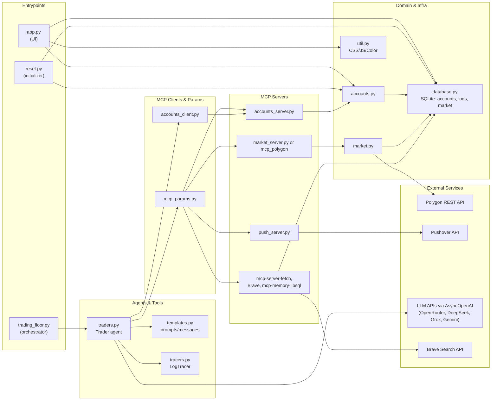

# MCP Server Concepts — Build and Use

This document explains the basics of **building** and **using** MCP (Model Context Protocol) servers, with concrete examples. Tool usage is driven by **instructions** (agent behavior) and **request prompts** (user query).

**This project builds three home-made MCP servers** in `src/`:

| Server | File | Role |
|--------|------|------|
| **Accounts** | `accounts_server.py` | Account balance, holdings, buy/sell, strategy (tools + resources) |
| **Market** | `market_server.py` | Share price lookup (calls Polygon/cache) |
| **Push** | `push_server.py` | Push notifications (calls Pushover API) |

They are used by the trading orchestrator and agents; the examples below (Brave Search, market server, push server) show the same build-and-use pattern.

**We also use several external MCP servers** (not built in this repo). They are started via `mcp_params.py` and used by the **Researcher** agent (and optionally the **Trader** for market data):

| External MCP | Role | Used by |
|--------------|------|---------|
| **Brave Search** (`@modelcontextprotocol/server-brave-search`) | Web and local search; news, articles | Researcher |
| **Polygon** (`mcp_polygon` from polygon-io) | Market data (aggs, snapshots, etc.); optional, for paid/realtime plans | Trader (when configured) |
| **mcp-server-fetch** | HTTP fetch (fetch URL content) | Researcher |
| **mcp-memory-libsql** | Per-trader persistent memory (entities, relations) | Researcher |

Our home-made **market_server.py** wraps Polygon (or cache) for the free/EOD case; when using a paid Polygon plan, we can switch to the full **mcp_polygon** server instead. For full low-level detail (how each server is configured, which tools they expose, and how agents call them), see the [Low-Level Design (LLD)](https://github.com/aditya-caltechie/ai-mcp-autonomous-traders/blob/main/docs/LLD.md) doc — especially **§2 MCP Configuration** and **§8 Integrated View** (diagram below mirrors that section).

---
## 1. Basics: What Is an MCP Server?

An MCP server exposes **tools** (and optionally **resources**, **prompts**) to an AI agent. The agent runs in a client (e.g. OpenAI Agents SDK); the client talks to the server over **stdio** or **SSE**. The agent decides **when** and **which** tools to call based on:

1. **Instructions** — system/agent instructions that describe the agent’s role and how it should use tools.
2. **Request** — the user’s message (e.g. “What’s the latest news on Tesla?”).

So: **instructions + request → agent chooses tools → server runs them → agent uses results in the reply.**

**MCP is not a framework for building agents.** It is a **protocol** — a standard way for an agent (or any client) to talk to services that expose capabilities. Think of it as a simple, consistent way to integrate **tools**, **resources**, and **prompts** into your agent stack. You still build agents with an agent framework (e.g. OpenAI Agents SDK); MCP defines how those agents discover and call tools, read resources, and use prompt templates.

---

### How MCP Works: Three Components

MCP has three main pieces:

1. **MCP Client** — The application or agent runtime (e.g. your app using the OpenAI Agents SDK) that wants to use tools, resources, or prompts. The agent runs inside the client.
2. **MCP Server** — The process that exposes those capabilities. It can run locally on your machine or on a remote host. It provides **tools** (callable functions), **resources** (readable URIs), and optionally **prompts** (templates).
3. **Transport** — How the client and server communicate. The protocol supports two mechanisms: **stdio** (for local subprocess servers) and **SSE** (for remote or in-process HTTP-based servers).

Most often, MCP servers run on your machine: you download or build them and run them locally. Clients on the same host connect to them. Optionally, a client can also talk to a **remote** MCP server over the network; that server may in turn call external APIs.

```
┌────────────────────────────────────────────────────────────────────-─┐
│ Your computer (Host)                                                 │
│                                                                      │
│   ┌─────────────┐   ┌─────────────┐   ┌─────────────┐                │
│   │ MCP Client  │   │ MCP Client  │   │ MCP Client  │  ← Agent runs  │
│   └──────┬──────┘   └──────┬──────┘   └──────┬──────┘    here        │
│          │ stdio / SSE     │                 │                       │
│   ┌──────▼──────┐   ┌──────▼──────┐                                  │
│   │ MCP Server  │   │ MCP Server  │   (local: tools, resources)      │
│   └─────────────┘   └─────────────┘                                  │
└───────────────────────────────────────────────────────────────────-──┘
          │ SSE (when using a remote server)
          ▼
┌─────────────────────────────────────────────────────────────────────┐
│ Remote server                                                       │
│   ┌─────────────┐          ┌─────────────┐                          │
│   │ MCP Server  │ ────────►│ External API│  (e.g. Brave, Polygon)   │
│   └─────────────┘          └─────────────┘                          │
└─────────────────────────────────────────────────────────────────────┘
```

*(“MCP Servers most often run on your box”).*

---

### Transport: stdio vs SSE

The client and server need a way to exchange messages. MCP defines two transports:

- **stdio** — The server runs as a **local subprocess**. The client spawns it (e.g. `uv run market_server.py` or `npx -y @modelcontextprotocol/server-brave-search`) and communicates over standard input/output. This is the typical choice for “run on your box” servers and is what we use in this project.
- **SSE (Server-Sent Events)** — The server is an **HTTP endpoint**. The client connects over HTTP using SSE. This is used for **remote** MCP servers or when the server is not a subprocess (e.g. a long-running service or a hosted MCP).

In both cases, the same protocol runs on top; only the wire format and process model differ.

---

### MCP Server = Multiple Tools (and More) for Agents

An MCP server exposes one or more **tools** — callable functions with a name, description, and input schema. When you build an agent, you attach one or more MCP servers to it. The agent sees the union of all tools from those servers and, based on **instructions** and the **user request**, decides when to call which tool. So: the server does not “run” the agent; it **provides** the tools the agent uses. Resources and prompts (if the server supports them) extend this same idea: the agent can read resources or fill in prompt templates as part of its workflow.

---

## 2. Types of MCP Servers (from Lab 3)

| Type | Description | Example |
|------|-------------|---------|
| **Local only** | Runs locally, no external API | Memory (mcp-memory-libsql) |
| **Local → web** | Runs locally, calls a web API | Brave Search, Polygon |
| **Remote** | Hosted elsewhere; less common | Anthropic/Cloudflare hosted MCPs |

We focus on **local** and **local → web**; both are started as child processes (e.g. `npx`, `uv run`). In this repo, **accounts_server** is local-only (SQLite); **market_server** and **push_server** are local processes that call external APIs (Polygon, Pushover).

---

## 3. How to *Use* an MCP Server [Important]

**High-level steps:**

1. **Create or run an MCP server** — Either build your own (e.g. with FastMCP in Python) or run an existing one (e.g. via `npx` or `uv run`). The server exposes tools (and optionally resources, prompts). (e.g. `server.list_tools()`) to see names and schemas.
2. **Create an MCP client** — Get a connection to that server. In code, something like `async with MCPServerStdio(params=...) as mcp_server` starts the server process and gives you a client handle (`mcp_server`) to talk to it.
3. **Create an agent and attach the client** — Build your agent (the LLM actor) and pass the MCP client so it can call the server's tools: `Agent(..., mcp_servers=[mcp_server])`.
4. **Run the agent with a request** — Execute the agent with a user message; when the model decides to use a tool, the framework uses the MCP client to call the server and returns the result.

Same pattern: start server → get client → create agent with client → run agent.

Instructions and request are the main knobs for “how” the tools get used.

---

## 4. Example 1: Brave Search MCP (Use an Existing Server)

We **do not build** this server; we **run** the official Brave Search MCP and **use** its tools via instructions and request.

### 4.1 How we run it - 

Step-1: start MCP server with `uv` command

- **Command:** run the npm package with `npx`; pass the API key in `env`.

```python
import os
from agents.mcp import MCPServerStdio

env = {"BRAVE_API_KEY": os.getenv("BRAVE_API_KEY")}
params = {
    "command": "npx",
    "args": ["-y", "@modelcontextprotocol/server-brave-search"],
    "env": env,
}

async with MCPServerStdio(params=params, client_session_timeout_seconds=30) as server:
    mcp_tools = await server.list_tools()
```

- Get a free key at [brave.com/search/api](https://brave.com/search/api/) and set `BRAVE_API_KEY` in `.env`.

### 4.2 What tools are available

| Tool | Purpose |
|------|--------|
| `brave_web_search` | Web search: general queries, news, articles. Params: `query`, optional `count` (1–20), `offset` for pagination. |
| `brave_local_search` | Local businesses/places (e.g. “pizza near Central Park”). Params: `query`, optional `count`. |

So: **two tools** — one for the web, one for local search.

### 4.3 How we use them: instructions + request

The agent has **no built-in rule** to “always use Brave.” We tell it what it can do and what we want via **instructions** and **request**.

**Instructions** (what the agent is allowed to do and how to behave):

```python
instructions = "You are able to search the web for information and briefly summarize the takeaways."
```

**Request** (what we ask; this pushes the model toward calling the tool):

```python
request = (
    "Please research the latest news on Tesla stock price and briefly summarize its outlook. "
    f"For context, the current date is {datetime.now().strftime('%Y-%m-%d')}."
)
```

**Run:**

We're not creating the agent "inside" MCP. We're creating an agent and giving it an MCP client so it can call tools on an MCP server.

- **`async with MCPServerStdio(...) as mcp_server`**  
  Starts the MCP server as a subprocess (e.g. Brave Search).  
  `mcp_server` is the client to that server (the handle our process uses to talk to it).

- **`Agent(..., mcp_servers=[mcp_server])`**  
  Creates the agent (the LLM actor) in our process.  
  We pass the MCP client so the agent framework can invoke tools on that server when the model chooses a tool.

- **`Runner.run(agent, request)`**  
  Runs the agent. When it calls a tool, the framework uses the MCP client to send the call to the MCP server subprocess and returns the result.

So: agent = LLM in our process; MCP server = separate process that exposes tools; MCP client = connection we pass into the agent so it can use those tools. The agent uses MCP; it isn't "inside" the MCP server.

```python
async with MCPServerStdio(params=params, client_session_timeout_seconds=30) as mcp_server:
    agent = Agent(
        name="agent",
        instructions=instructions,
        model="gpt-4o-mini",
        mcp_servers=[mcp_server],
    )
    result = await Runner.run(agent, request)
```

Flow in words:

1. **Instructions** say: “you can search the web and summarize.”
2. **Request** asks for “latest news on Tesla… summarize outlook.”
3. The model infers it needs current web content → calls `brave_web_search` with a suitable query.
4. It uses the search results to produce a short summary.

So: **instructions + request drive which tool is used and how.**

---

## 5. Example 2: Building Our Own MCP (Market Server)

Here we **build** a small MCP server that exposes one tool: current share price. Then we use it the same way: instructions + request.

### 5.1 How we build it

- Use **FastMCP** (Python). One server process, one or more tools.
- **Define tools** as async functions; docstrings and type hints become the tool schema the client sees.

**File: `market_server.py`**

```python
from mcp.server.fastmcp import FastMCP
from market import get_share_price

mcp = FastMCP("market_server")

@mcp.tool()
async def lookup_share_price(symbol: str) -> float:
    """This tool provides the current price of the given stock symbol.

    Args:
        symbol: the symbol of the stock
    """
    return get_share_price(symbol)

if __name__ == "__main__":
    mcp.run(transport='stdio')
```

where `get_share_price` was called from internal file market.py , which eveyually calls `get_all_share_prices_polygon_eod` - making a REST API call to polygon for getting the market prices eventually. Below is just snippet:

```python
def get_all_share_prices_polygon_eod() -> dict[str, float]:

    client = RESTClient(polygon_api_key)

    # Get the previous close price for SPY using the Polygon API
    probe = client.get_previous_close_agg("SPY")[0]
    last_close = datetime.fromtimestamp(probe.timestamp / 1000, tz=timezone.utc).date()

    # Get the daily aggregated prices for all stocks using the Polygon API
    results = client.get_grouped_daily_aggs(last_close, adjusted=True, include_otc=False)
    return {result.ticker: result.close for result in results}

```

Steps in short:

1. Create `FastMCP("market_server")`.
2. Register a tool with `@mcp.tool()`; implement the function (here: call `get_share_price`).
3. Run with `mcp.run(transport='stdio')` so the client talks over stdio.

The client will see a tool named `lookup_share_price` with one argument `symbol` (string) and a numeric result.

### 5.2 What tools are available

| Tool | Purpose |
|------|--------|
| `lookup_share_price` | Current price for a given stock symbol. Input: `symbol` (e.g. `"AAPL"`). Output: price (float). |

So: **one tool** for share price lookup.

### 5.3 How we use them: instructions + request

Same idea as Brave: we don’t hard-code “call lookup_share_price”; we describe the agent’s role and ask a question that implies using the tool.

**Instructions:**

```python
instructions = "You answer questions about the stock market."
```

**Request:**

```python
request = "What's the share price of Apple?"
```

**Run:**

```python
params = {"command": "uv", "args": ["run", "market_server.py"]}

async with MCPServerStdio(params=params, client_session_timeout_seconds=60) as mcp_server:
    agent = Agent(
        name="agent",
        instructions=instructions,
        model="gpt-4.1-mini",
        mcp_servers=[mcp_server],
    )
    result = await Runner.run(agent, request)
```

Flow:

1. **Instructions** say: “you answer questions about the stock market.”
2. **Request** asks: “What’s the share price of Apple?”
3. The model infers it needs a price → calls `lookup_share_price(symbol="AAPL")`.
4. It uses the returned price in its answer.

So again: **instructions + request drive tool use.**

---

## 6. Example 3: Push Server (Notify via External API)

Here we **build** an MCP server that exposes one tool: send a push notification. The server runs locally but calls an external API (Pushover). Same pattern: build with FastMCP, then use via instructions + request.

### 6.1 How we build it

- Use **FastMCP** and one tool that takes a structured argument (Pydantic model).
- The tool POSTs to Pushover’s API; credentials come from env (`PUSHOVER_USER`, `PUSHOVER_TOKEN`).

**File: `push_server.py`**

```python
import os
from dotenv import load_dotenv
import requests
from pydantic import BaseModel, Field
from mcp.server.fastmcp import FastMCP

load_dotenv(override=True)

pushover_user = os.getenv("PUSHOVER_USER")
pushover_token = os.getenv("PUSHOVER_TOKEN")
pushover_url = "https://api.pushover.net/1/messages.json"

mcp = FastMCP("push_server")

class PushModelArgs(BaseModel):
    message: str = Field(description="A brief message to push")

@mcp.tool()
def push(args: PushModelArgs):
    """Send a push notification with this brief message"""
    print(f"Push: {args.message}")
    payload = {"user": pushover_user, "token": pushover_token, "message": args.message}
    requests.post(pushover_url, data=payload)
    return "Push notification sent"

if __name__ == "__main__":
    mcp.run(transport="stdio")
```

Steps in short:

1. Create `FastMCP("push_server")`.
2. Register a tool with `@mcp.tool()`; use a Pydantic model for arguments so the client gets a clear schema.
3. Implement the handler: send the message to Pushover, return a confirmation.
4. Run with `mcp.run(transport='stdio')`.

Set `PUSHOVER_USER` and `PUSHOVER_TOKEN` in `.env` (from [pushover.net](https://pushover.net/)).

### 6.2 What tools are available

| Tool | Purpose |
|------|--------|
| `push` | Send a push notification. Input: `message` (string). Output: confirmation text. |

So: **one tool** for notifications; the server is “local → web” (calls Pushover API).

### 6.3 How we use them: instructions + request

**Instructions** (when the agent should notify):

```python
instructions = (
    "You are a trading assistant. When you complete a significant trade or rebalance, "
    "use the push tool once to send a brief summary to the user."
)
```

**Request** (example that leads to a notification):

```python
request = "I just bought 10 shares of AAPL. Notify me with a one-line summary."
```

**Run:**

```python
params = {"command": "uv", "args": ["run", "push_server.py"]}

async with MCPServerStdio(params=params, client_session_timeout_seconds=60) as mcp_server:
    agent = Agent(
        name="agent",
        instructions=instructions,
        model="gpt-4.1-mini",
        mcp_servers=[mcp_server],
    )
    result = await Runner.run(agent, request)
```

Flow:

1. **Instructions** say: use the push tool for significant events and send a brief summary.
2. **Request** describes an action (“I just bought…”) and asks for a notification.
3. The model infers it should notify → calls `push(message="...")` with a short summary.
4. The server POSTs to Pushover; the user gets the notification.

So again: **instructions + request drive tool use.**

---
## 7. Integrated view: modules and MCP dependencies

The diagram below is the same **integrated view** as in [LLD §8](https://github.com/aditya-caltechie/ai-mcp-autonomous-traders/blob/main/docs/LLD.md). It summarizes which modules depend on MCP servers, DB, and external APIs.



For per-module call flow and sequence diagrams, see the full [Low-Level Design (LLD)](https://github.com/aditya-caltechie/ai-mcp-autonomous-traders/blob/main/docs/LLD.md).

---

## 8. Summary: Instructions and Request

- **Instructions** = agent’s role and how it may use tools (e.g. “search the web and summarize”, “answer stock market questions”, “notify with push when significant”).
- **Request** = user message; the more specific it is (e.g. “latest Tesla news”, “Apple share price”), the more likely the right tool is used.
- The **model** decides which tools to call and with what arguments; we don’t call tools by name in code. We only configure the server, pass instructions + request, and run the agent.

### Quick reference

| Step | Brave Search | Our market_server | Our push_server |
|------|----------------|-------------------|-----------------|
| Run server | `npx -y @modelcontextprotocol/server-brave-search` + `BRAVE_API_KEY` | `uv run market_server.py` | `uv run push_server.py` |
| Tools | `brave_web_search`, `brave_local_search` | `lookup_share_price` | `push` |
| Use | Instructions: “search web and summarize”; Request: “latest Tesla news” | Instructions: “answer stock market questions”; Request: “Apple share price?” | Instructions: “notify with push when significant”; Request: “I bought 10 AAPL, notify me” |

For more on how this project wires MCP into traders and researchers, see **`docs/LLD.md`** and **`AGENTS.md`**.

---
## MCP Marketplace: Remote and Discoverable Servers

Beyond running open-source MCP servers locally, you can use **remote** or **hosted** MCP servers. These are often listed or offered in MCP-focused directories and marketplaces, so you can discover and connect to them without hosting the server yourself. Examples of such places:

- **[mcp.so](https://mcp.so)** — MCP directory and resources.
- **[Glamira.ai MCP](https://glamara.ai/mcp)** — MCP-related offerings and integrations.
- **[Smithery](https://smithery.ai/)** — Platform for AI tools and MCP servers.

Connecting to a remote server usually means using the **SSE** transport and the URL (and any auth) provided by the marketplace or provider. Your MCP client (e.g. your agent runtime) then talks to that URL instead of starting a local subprocess.

---